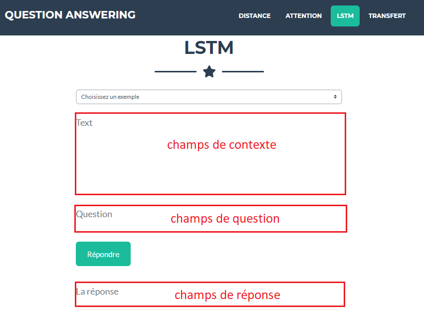

# Question answering project for Master degree artificial intelligence USTHB ( University of science and technology Houari Boumediene, Algeria )

We have four models trained on Squad dataset ( stanford question answering dataset ), the task is the domain of question answering, to answer questions about a text given.

---
## Tools and laguages :

- Squad Dataset.
- Infersent.
- Glove.
- Bert model.
- Keras and tensorflow.

---

## Results of the models :
| Model name | F1-score | Exact match (EM) | Pourcentage of correct sentences
| ----------- | ----------- | ----| --- |
| Distances euclidian Model | 0 | 0 | 54%
| Distances cosinus similarity Model | 0 | 0 | 48%
| Lstm simple | 45% | 0 |
| Lstm with attention | 58% | 75% |
| Bert | 77% | 75% |

---
## Preview of the App :

 

